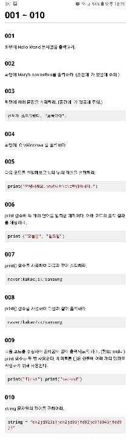
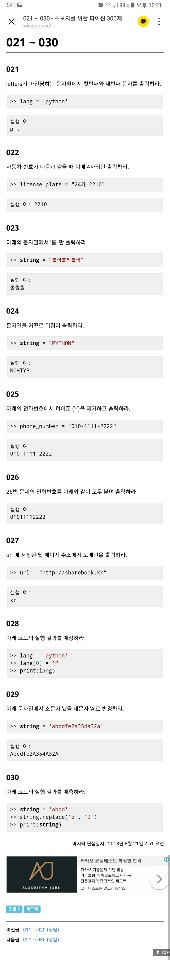
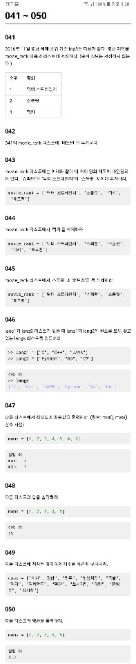
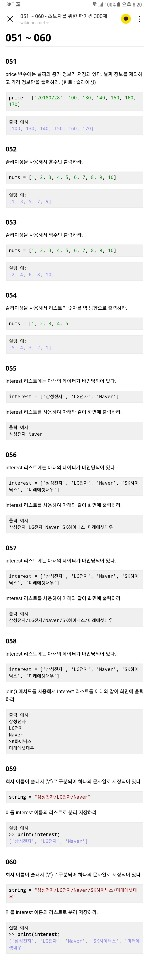
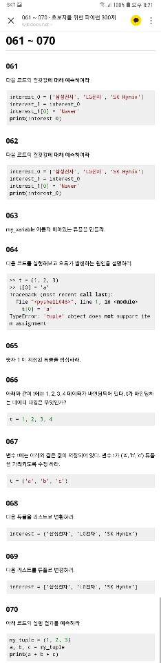
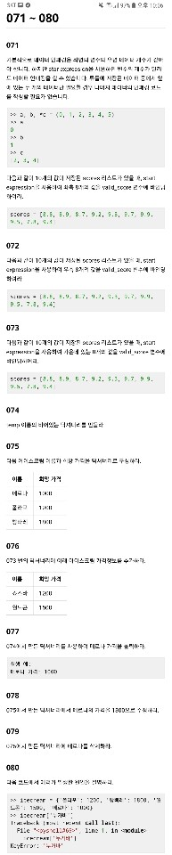
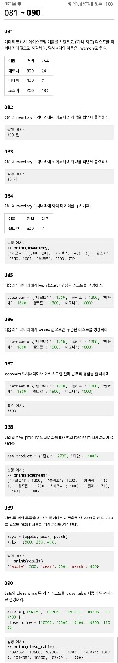
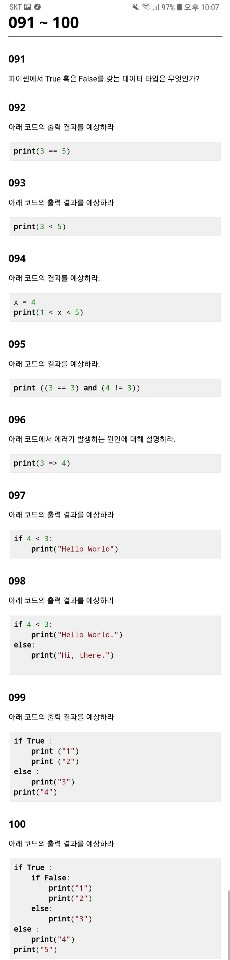

# 파이썬 문제



```python
#1
print("Hello World!")
```

```python
#2
print("Mary's cosmetics")
```

```python
#3
print('신씨가 소리질렀다."도둑이야"')
```

```python
#4
print("C:\\\windows")
```

```python
#5
print("안녕하세요.\n만나서\t\t반갑습니다.") 
//  \n:줄바꿈
//  \t:수평탭 
```

```python
#6
print ("오늘은", "일요일")
// 오늘은 일요일
```

```python
#7
print ("Naver", "Kakao","Sk","Samsung",sep = ";") //sep: 공백을 넣을 수 있다.
``` 

```python
#8
print ("Naver", "Kakao","Sk","Samsung",sep ="\")
```

```python
#9
print ("First", end = " ");print("Second",end = " ");
```

```python
#10
print (len(string)) //len으로 문자열의 길이 파악
``` 


```python
#11
>> a = "3" >> b = "4"
>> print(a + b)
34 
```

```python
#12
print(s + '! '+ t) 
```

```python
#13
>>print("Hi" * 3)
HiHiHi 
```

```python
#14
print("-" * 80) 
```

```python
#15
print((t1 + ' ' + t2 + ' ')*4) 
```

```python
#16
print(20000*10) 
```

```python
#17
>> 2 + 2 * 3
​8 
```

```python
#18
>> a = 128
>> print (type(a))
<class 'int'>

​>> a = "132"
​<class 'str'> // 따옴표로 이뤄져있으면 문자열
```

```python
#19
num = int(num_str) // str 형을 그냥 int로 선언
```

```python
#20
num_str = str(num) // str로 num선언
```



```python
#21
print(lang[0],' ',lang[2]) //배열 안에서 0부터 시작
```

```python
#22
print(license_plate[4],license_plate[5],license_plate[6],​license_plate[7])
```

```python
#23
print(string[::1]) // 0부터 한칸씩 띄어서 print
```

```python
#24
print(string[5::-1]) // 끝에서부터 역순으로 
```

```python
#25
phone_number.replace('-', ' ') // replace 메소드 사용 가능
```

```python
#26
phone_number.replace('-', '')
```

```python
#27
print(url[-2:]) // 끝에 2개
```

```python
#28
TypeError: 'str' object does not support item assignment
```

```python
#29
string.replace('a', 'A') // replace 메소드 사용
```

```python
#30
abcd // replace를 썼을 때 다른 변수에 넣어줘야 함
``` 



```python
#41
movie_rank = ["닥터 스트레인지", "스플릿", "럭키"]
```

```python
#42
movie_rank .append("배트맨") //append 메소드로 배열 맨 뒤 추가
```

```python
#43
movie_rank.insert(1,"슈퍼맨") // insert로 지정 위치에 삽입
```

```python
#44
movie_rank.remove('럭키') // 직접 지우기
```

```python
#45
movie_rank.remove('스플릿')
movie_rank.remove('배트맨')
​del movie_rank[2:] // 뒤에서 지우기
```

```python
#46
langs = lang1 + lang2 // 배열은 배열간의 합으로 표시 가능
```

```python
#47
print("max: ",max(nums))
print("min: ",min(nums)) // 삼다항 사용 필요없이 배열은 min,max로 바로 구할 수 있음
```

```python
#48
print(sum(nums)) // 합은 sum으로 바로 구해짐
```

```python
#49
print(len(cook)) // str과 마찬가지로 배열의 길이 구할 수 있음
```

```python
#50
print((sum(nums))/len(nums))
```



```python
#51
print(price[1:7]) 
```

```python
#52
print(nums[::2]) 
```

```python
#53
print(nums[1::2]) 
```

```python
#54
print(nums[::-1]) 
```

```python
#55
print(interest[0],interest[2])
```

```python
#56
print(' '.join(interest)) // ' '를 공백으로 두고 join으로 나열시킨다
```

```python
#57
print('/'.join(interest))
```

```python
#58
print('\n'.join(interest))
```

```python
#59
interest = []
interest.append(string[0:4])
interest.append(string[5:9])
interest.append(string[10:15]) // 먼저 배열 선언하고 각각의 string부분을 나눠서 배열에 추가
```

```python
#60
interest = string.split('/') // split으로 /로 나눌 수 있다
``` 



```python
#61
interest_0 = ['삼성전자', 'LG전자', 'SK Hynix']
interest_1 = interest_0
interest_1[0] = 'Naver'
print(interest_0) //넣어주는 것과 마찬가지
// ['Naver', 'LG전자', 'SK Hynix']
```

```python
#62
? 
```

```python
#63
my_variable () 
```

```python
#64
tuple 은 변경 불가능 arr // array와 비슷한 개념이지만 바꿀 것이 없을 때 사용
```

```python
#65
my_tuple(1,) // 한개만 있어도 무조건 , 넣기
```

```python
#66
int
```

```python
#67
t = (t[0].upper(), t[1], t[2]) // 새로 지정을 해주거나 아니면 upper로 대문자로 바꿔주기
```

```python
#68
data = list(interest) // 튜플은 바로 list 선언가능
```

```python
#69
data = tuple(interest) // 리스트도 튜플로 바꿀 수 있음
```

```python
#70
my_tuple = (1, 2, 3)
a, b, c = my_tuple
print(a + b + c) // 각각의 값이 대입되었다.
```



```python
#71
/*데이터 패킹과 언패킹: 
    여러 개의 수르르 튜플을 담고 그 튜플을 변수에 대입하면 변수 하나가 여러 개의 데이터를 가질수 있음
    여러 개의 데이터를 컬렉션으로 묶어 변수에 대입하는 것을 패킹(packing)이라고 부른다.
    언패킹할 때, 즉 시퀀스의 요소를 변수 시퀀스에 나눠 대입할 때는 두 시퀀스의 길이가 일치해야 한다.*/

*valid_score, a, b = scores
```

```python
#72
_, _, *valid_score = scores
```

```python
#73
_, *valid_score, _ = scores
```

```python
#74
temp = {}
```

```python
#75
icecream_price = {'메로나':1000, '폴라포':1200, '빵빠레':1800}
```

```python
#76
icecream_price['죠스바'] = 1200
icecream_price['월드콘'] = 1500
// 딕셔너리 추가는 각각 해준다.
```

```python
#77
print("메로나 가격:", icecream_price['메로나']) // 딕셔너리는 dict이름과 원하는 요소를[] 안에 넣어서 프린트
```

```python
#78
icecream_price['메로나'] = 1300 // 넣어주는 것과 똑같이
```

```python
#79
del icecream['Melona']
```

```python
#80
>> icecream = {'폴라포': 1200, '빵빠레': 1800, '월드콘': 1500, '메로나': 1000}
>> icecream['누가바']
Traceback (most recent call last):
  File "<pyshell#69>", line 1, in <module>
    icecream['누가바']
KeyError: '누가바'
딕셔너리에 누가바가 없다. 에러를 없애기 위해서는 코드에서 묻는 것을 바꾸거나 누가바를 딕셔너리에 추가한다.
```



```python
#81
inventory ={'메로나':[300, 20], '비비빅':[400, 3], '죠스바':[250, 100]}
```

```python
#82
print("메로나 가격:", inventory['메로나'][0],"원")
```

```python
#83
print("메로나 재고:", inventory['메로나'][1],"개")
```

```python
#84
inventory['월드콘'] = [500, 7]
```

```python
#85
list(icecream.keys())
```

```python
#86
list(icecream.values())
```

```python
#87
print(sum(icecream.values()))
```

```python
#88
icecream['팥빙수'] = 2700
icecream['아맛나'] = 1000
```

```python
#89
keys = (apple, pear, peach)
vals = (300, 250, 400)
result = dict(zip(keys, vals))
>> print(result)
{'apple': 300, 'pear': 250, 'peach': 400}
```

```python
#90
close_table = dict(zip(date, close_price))
```



```python
#91
Boolean 데이터 타입 //불리언(boolean) 자료형은 논리 자료형이라고도 하며, 참과 거짓을 나타내는 데 쓰인다. 주로 참은 1, 거짓은 0에 대응
```

```python
#92
False
```

```python
#93
True
```

```python
#94
True
```

```python
#95
True
```

```python
#96
비교연산자로 쓰기 위해서는 3 >= 4 라고 해야한다.
```

```python
#97

```

```python
#98
"Hi, there."
```

```python
#99
1
2
4
```

```python
#100
3
5
```